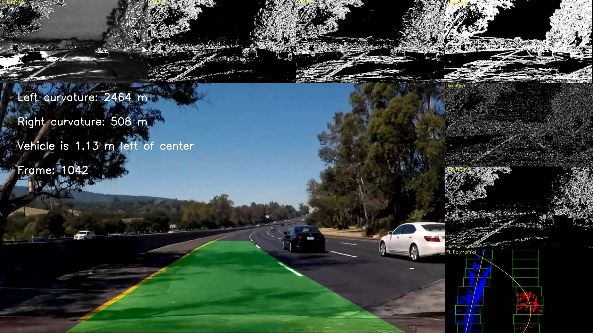

**Advanced Lane Finding Project**

The goals / steps of this project are the following:

* Compute the camera calibration matrix and distortion coefficients given a set of chessboard images.
* Apply a distortion correction to raw images.
* Use color transforms, gradients, etc., to create a thresholded binary image.
* Apply a perspective transform to rectify binary image ("birds-eye view").
* Detect lane pixels and fit to find the lane boundary.
* Determine the curvature of the lane and vehicle position with respect to center.
* Warp the detected lane boundaries back onto the original image.
* Output visual display of the lane boundaries and numerical estimation of lane curvature and vehicle position.

## [Rubric](https://review.udacity.com/#!/rubrics/571/view) Points

### Here I will consider the rubric points individually and describe how I addressed each point in my implementation.  

---

### Camera Calibration

#### 1. Briefly state how you computed the camera matrix and distortion coefficients. Provide an example of a distortion corrected calibration image.

The code for this step is contained in the IPython notebook located in `01 - Camera Calibration.ipynb`.  

I start by preparing "object points", which will be the (x, y, z) coordinates of the chessboard corners in the world. Here I am assuming the chessboard is fixed on the (x, y) plane at z=0, such that the object points are the same for each calibration image.  Thus, `objp` is just a replicated array of coordinates, and `objpoints` will be appended with a copy of it every time I successfully detect all chessboard corners in a test image.  `imgpoints` will be appended with the (x, y) pixel position of each of the corners in the image plane with each successful chessboard detection.  

I then used the output `objpoints` and `imgpoints` to compute the camera calibration and distortion coefficients using the `cv2.calibrateCamera()` function.  I applied this distortion correction to the test image using the `cv2.undistort()` function and obtained this result: 


### Pipeline (single images)

#### 1. Provide an example of a distortion-corrected image.

To demonstrate this step, I will describe how I apply the distortion correction to one of the test images like this one:


#### 2. Describe how (and identify where in your code) you used color transforms, gradients or other methods to create a thresholded binary image.  Provide an example of a binary image result.

I used a combination of color and gradient thresholds to generate a binary image (thresholding steps at `02 - Color Transform and Gradients Threshold.ipynb`). Here's the result of my output for this step: XY Sobel Orientations, Magnitudes and Directions of Gradients, Conbination Thresholds.  


#### 3. Describe how (and identify where in your code) you performed a perspective transform and provide an example of a transformed image.

The code for my perspective transform  in the file `03 - Perspective transformation.ipynb` with the title: `Apply a perspective transform`.  The function takes as inputs an image (`undist`), as well as source (`src`) and destination (`dst`) points. I chose the hardcode the source and destination points in the following manner:

```python
bottomY = 720
topY = 455

left1 = (190, bottomY)
left1_x, left1_y = left1
left2 = (585, topY)
left2_x, left2_y = left2

right1 = (705, topY)
right1_x, right1_y = right1
right2 = (1130, bottomY)
right2_x, right2_y = right2

src = np.float32([[left2_x, left2_y],
                  [right1_x, right1_y],
                  [right2_x, right2_y],
                  [left1_x, left1_y]])
nX = gray.shape[1]
nY = gray.shape[0]
imgSize = (nX, nY)
offset = 200
dst = np.float32([[offset, 0],
                  [imgSize[0]-offset, 0],
                  [imgSize[0]-offset, imgSize[1]], 
                  [offset, imgSize[1]]])
```

This resulted in the following source and destination points:

| Source        | Destination   | 
|:-------------:|:-------------:| 
|  585, 455     | 200,    0     | 
|  705, 455     | 1080,   0     |
| 1130, 720     | 1080, 720     |
|  190, 720     | 200,  720     |

I verified that my perspective transform was working as expected by drawing the `src` and `dst` points onto a test image and its warped counterpart to verify that the lines appear parallel in the warped image.


#### 4. Describe how (and identify where in your code) you identified lane-line pixels and fit their positions with a polynomial?

I did this in my code in `Advance Lane Lines.ipynb`

Then I did some other stuff and fit my lane lines with a 2nd order polynomial kinda like this:

#### 5. Describe how (and identify where in your code) you calculated the radius of curvature of the lane and the position of the vehicle with respect to center.

I did this in my code in `Advance Lane Lines.ipynb`, in cell with title: `6. Determine the curvature of the lane and vehicle position with respect to center.`

#### 6. Provide an example image of your result plotted back down onto the road such that the lane area is identified clearly.

Before 

I implemented this step in title cell `8. Output visual display of the lane boundaries and numerical estimation of lane curvature and vehicle position.` in my code in `Advance Lane Lines.ipynb` in the function `estimationsLane()`.  Here is the result on the tests images:


---

### Pipeline (video)

#### 1. Provide a link to your final video output.  Your pipeline should perform reasonably well on the entire project video (wobbly lines are ok but no catastrophic failures that would cause the car to drive off the road!).

The debug mode was used to find out which frames did not have the lines recognized correctly (1040 and 1042).

In debug mode (debug = True), frames with recognition errors are located. A debug video is created: [link to my video debug](./output_images/project_video_debug.mp4)

The frames with errors have their frame number registered in the variable "frames_errors" and their recorded images:


3 minimum and maximum limits of the coordinates of the adjustment lines (distance_top, distance_middle, distance_bottom) were calculated and recorded in "distances_limits.p".

The limits were established with minimum and maximum values ​​only with the coordinates of the valid lines.

In this way, any line (left or right) that does not fit the limits is discarded and the calculated lines from the previous valid frame are used.

Before recording the video, the left and right lines of the tracks were validated with the lane_check (left_fitx, right_fitx) function.




Here's a [link to my video result](./output_images/project_video.mp4)

---

### Discussion

#### 1. Briefly discuss any problems / issues you faced in your implementation of this project.  Where will your pipeline likely fail?  What could you do to make it more robust?

Detecting white and dashed lines turned out to be more difficult than detecting yellow lines, as shadows and changes in the color of the runway negatively influenced the recognition of the lanes.

This implementation will fail under adverse conditions to the test video, such as: heavy traffic, lane change, tunnels, snow, rain, fog, night, holes, painted signs, intersections, etc.

Applying a lot of effort in recognizing the tracks of a specific video can create an over-adjustment. Therefore, I used the limits on the adjustment lines to correct erroneous acknowledgments. These limits can be updated to cover other videos.

A convolutional neural network can be a more robust and generic solution, depending on the amount and variety of training data.

The advantage of using computer vision is that you do not need a large set of training data, as long as you have control of the type of lane to be recognized.

Image processing has its limits for determining the thresholds of the regions of interest to be recognized. The use of geometric calculations for adjustments and shape recognition is necessary to obtain success.

The performance of the algorithm is not a problem in videos already recorded, but in real time recognition can be a priority.

My interest in this type of recognition is to apply in my master's degree about eye tracking of drivers in a simulated environment. I need to recognize cars and lanes from a driving simulator. Computer vision seems to be a viable solution.
